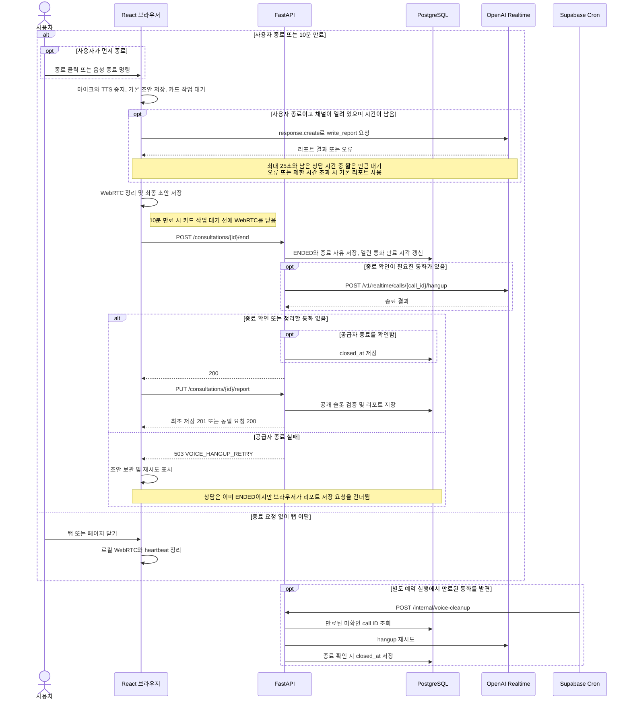
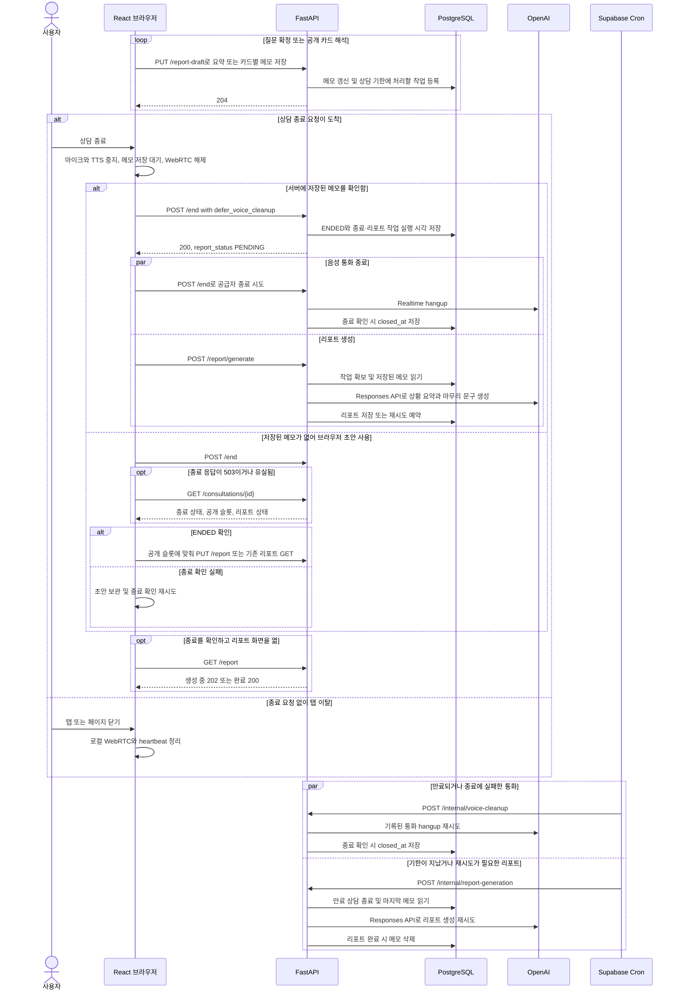

# 상담 종료와 리포트 시퀀스

API 경로는 `/api/v1` 기준입니다. 상담 ID 하위 API는 다이어그램에서 일부 생략했습니다.

## AS-IS

```mermaid
sequenceDiagram
    actor User as 사용자
    participant Browser as React 브라우저
    participant API as FastAPI
    participant DB as PostgreSQL
    participant OpenAI as OpenAI Realtime
    participant Cron as Supabase Cron

    alt 사용자 종료 또는 10분 만료
        opt 사용자가 먼저 종료
            User->>Browser: 종료 클릭 또는 음성 종료 명령
        end
        Browser->>Browser: 마이크와 TTS 중지, 기본 초안 저장, 카드 작업 대기
        opt 사용자 종료이고 채널이 열려 있으며 시간이 남음
            Browser->>OpenAI: response.create로 write_report 요청
            OpenAI-->>Browser: 리포트 결과 또는 오류
            Note over Browser,OpenAI: 최대 25초와 남은 상담 시간 중 짧은 만큼 대기<br/>오류 또는 제한 시간 초과 시 기본 리포트 사용
        end
        Browser->>Browser: WebRTC 정리 및 최종 초안 저장
        Note right of Browser: 10분 만료 시 카드 작업 대기 전에 WebRTC를 닫음
        Browser->>API: POST /consultations/{id}/end
        API->>DB: ENDED와 종료 사유 저장, 열린 통화 만료 시각 갱신
        opt 종료 확인이 필요한 통화가 있음
            API->>OpenAI: POST /v1/realtime/calls/{call_id}/hangup
            OpenAI-->>API: 종료 결과
        end
        alt 종료 확인 또는 정리할 통화 없음
            opt 공급자 종료를 확인함
                API->>DB: closed_at 저장
            end
            API-->>Browser: 200
            Browser->>API: PUT /consultations/{id}/report
            API->>DB: 공개 슬롯 검증 및 리포트 저장
            API-->>Browser: 최초 저장 201 또는 동일 요청 200
        else 공급자 종료 실패
            API-->>Browser: 503 VOICE_HANGUP_RETRY
            Browser->>Browser: 초안 보관 및 재시도 표시
            Note over Browser,DB: 상담은 이미 ENDED이지만 브라우저가 리포트 저장 요청을 건너뜀
        end
    else 종료 요청 없이 탭 이탈
        User->>Browser: 탭 또는 페이지 닫기
        Browser->>Browser: 로컬 WebRTC와 heartbeat 정리
    end

    opt 별도 예약 실행에서 만료된 통화를 발견
        Cron->>API: POST /internal/voice-cleanup
        API->>DB: 만료된 미확인 call ID 조회
        API->>OpenAI: hangup 재시도
        API->>DB: 종료 확인 시 closed_at 저장
    end
```

## TO-BE

서버에 중간 메모가 남아 있으면 독립 생성 경로를 사용합니다. 중간 메모가 없는 상담은 기존 초안으로 저장할 수 있습니다.

```mermaid
sequenceDiagram
    actor User as 사용자
    participant Browser as React 브라우저
    participant API as FastAPI
    participant DB as PostgreSQL
    participant OpenAI as OpenAI
    participant Cron as Supabase Cron

    loop 질문 확정 또는 공개 카드 해석
        Browser->>API: PUT /report-draft로 요약 또는 카드별 메모 저장
        API->>DB: 메모 갱신 및 상담 기한에 처리할 작업 등록
        API-->>Browser: 204
    end

    alt 상담 종료 요청이 도착
        User->>Browser: 상담 종료
        Browser->>Browser: 마이크와 TTS 중지, 메모 저장 대기, WebRTC 해제
        alt 서버에 저장된 메모를 확인함
            Browser->>API: POST /end with defer_voice_cleanup
            API->>DB: ENDED와 종료·리포트 작업 실행 시각 저장
            API-->>Browser: 200, report_status PENDING
            par 음성 통화 종료
                Browser->>API: POST /end로 공급자 종료 시도
                API->>OpenAI: Realtime hangup
                API->>DB: 종료 확인 시 closed_at 저장
            and 리포트 생성
                Browser->>API: POST /report/generate
                API->>DB: 작업 확보 및 저장된 메모 읽기
                API->>OpenAI: Responses API로 상황 요약과 마무리 문구 생성
                API->>DB: 리포트 저장 또는 재시도 예약
            end
        else 저장된 메모가 없어 브라우저 초안 사용
            Browser->>API: POST /end
            opt 종료 응답이 503이거나 유실됨
                Browser->>API: GET /consultations/{id}
                API-->>Browser: 종료 상태, 공개 슬롯, 리포트 상태
            end
            alt ENDED 확인
                Browser->>API: 공개 슬롯에 맞춰 PUT /report 또는 기존 리포트 GET
            else 종료 확인 실패
                Browser->>Browser: 초안 보관 및 종료 확인 재시도
            end
        end
        opt 종료를 확인하고 리포트 화면을 엶
            Browser->>API: GET /report
            API-->>Browser: 생성 중 202 또는 완료 200
        end
    else 종료 요청 없이 탭 이탈
        User->>Browser: 탭 또는 페이지 닫기
        Browser->>Browser: 로컬 WebRTC와 heartbeat 정리
    end

    par 만료되거나 종료에 실패한 통화
        Cron->>API: POST /internal/voice-cleanup
        API->>OpenAI: 기록된 통화 hangup 재시도
        API->>DB: 종료 확인 시 closed_at 저장
    and 기한이 지났거나 재시도가 필요한 리포트
        Cron->>API: POST /internal/report-generation
        API->>DB: 만료 상담 종료 및 마지막 메모 읽기
        API->>OpenAI: Responses API로 리포트 생성 재시도
        API->>DB: 리포트 완료 시 메모 삭제
    end
```
